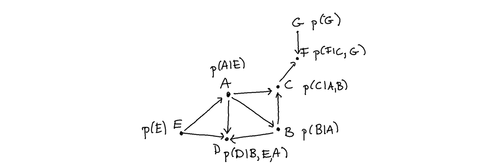

# dagger

## internals



```math
p(A, B, C, D, E, F, G) = p(A|E) p(B|A) p(C|A,B) p(D|A,B,E) p(E) p(F|C,G) p(G)
```

## planned usage 

```
from dagger import Graph, Query
dag = Graph(data=df)

dag.add_edge("smoking""tar")
dag.add_edge("tar", "cancer")
dag.add_edge("smoking", "cancer")
```

## project structure 

```
│
├── data/               <- The original, immutable data dump. 
├── notebooks/          <- Jupyter notebooks. Naming convention is a short `-` delimited 
│                          description, a number (for ordering), and the creator's initials,
│                          e.g. `initial-data-exploration-01-hg`.
├── tests/              <- Unit tests.
├── dagger/             <- Python module with source code of this project.
├── Makefile            <- Makefile with commands like `make environment`
└── README.md           <- The top-level README for developers using this project.
```

## installation 

Install `dagger` in the virtual environment via:

```bash
$ pip install --editable .
```
